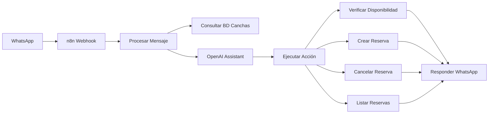

<div align="center">
  
# Padel Pro Project


</div>


Este proyecto permite automatizar la reserva de canchas de pádel, integrando WhatsApp y OpenAI para la gestión de un agente, y ofreciendo una interfaz web para la administración completa del sistema.

## Instalación

```bash
python3 -m venv .venv && source .venv/bin/activate
```

```bash
pip install -r requirements.txt
```

```bash
python3 main.py
```

```bash
sudo mysql -u root -p
sudo mysql -e "CREATE USER 'padelpro'@'localhost' IDENTIFIED BY 'padelpro123';"
sudo mysql -e "GRANT ALL PRIVILEGES ON padelpro.* TO 'padelpro'@'localhost';"
sudo mysql -e "FLUSH PRIVILEGES;"
sudo mysql -e "CREATE DATABASE padelpro;"
```

```bash
sudo nano /etc/systemd/system/padelpro.service
```

```ini
[Unit]
Description=PadelPro Flask Application
After=network.target

[Service]
Type=simple
User=root
WorkingDirectory=/root/padelpro/back
Environment="PATH=/root/padelpro/back/.venv/bin:/usr/local/bin:/usr/bin:/bin"
ExecStart=/root/padelpro/back/.venv/bin/python3 main.py
Restart=always
RestartSec=3

[Install]
WantedBy=multi-user.target
```

```bash
sudo systemctl daemon-reload
sudo systemctl restart padelpro
sudo systemctl status padelpro
```

## N8N Implementation

